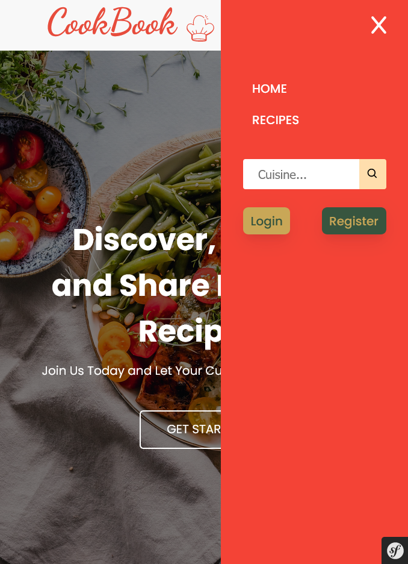
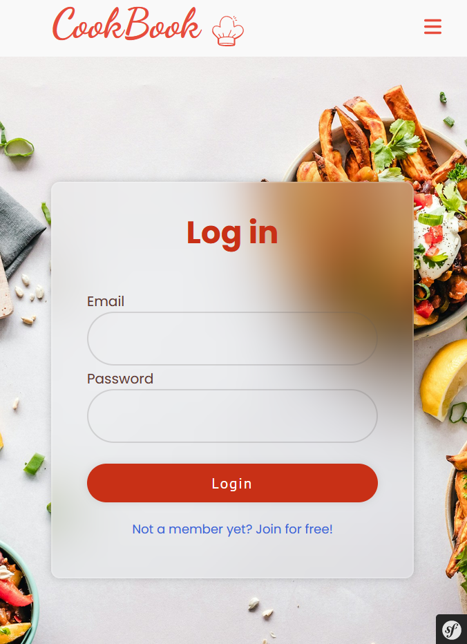
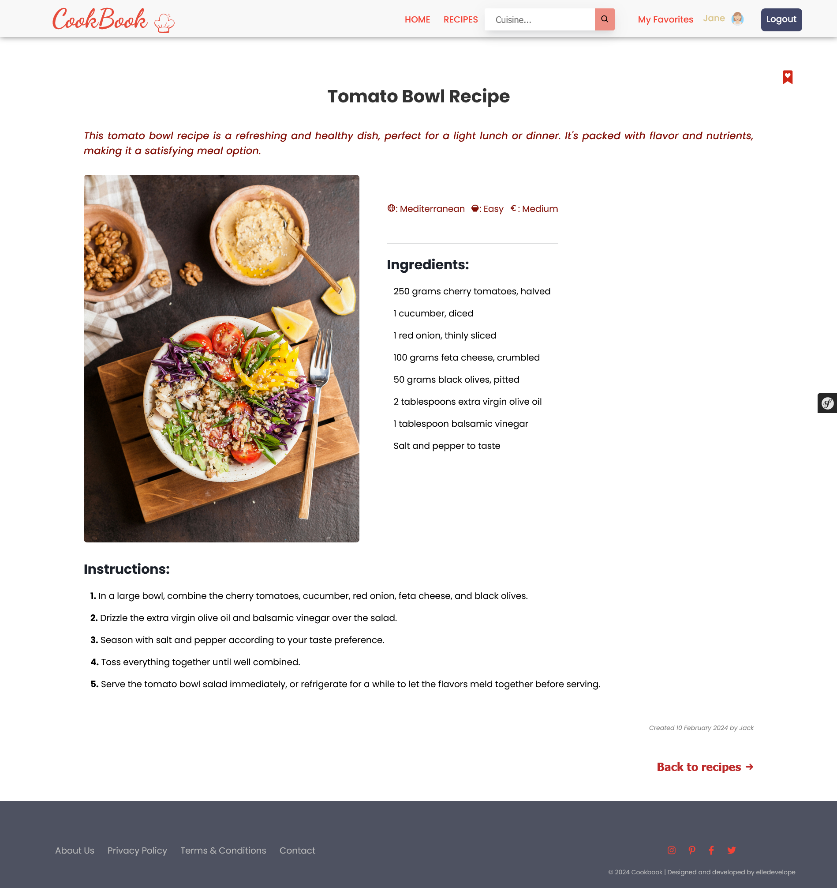

# Cookbook Website: Symfony, PHP, MySQL

## Overview

This project is a web application developed using Symfony and PHP, designed to serve as a "Cookbook" where registered users can perform CRUD operations on recipes. The website includes user authentication, role-based access control with an admin role, and AJAX functionality for registered users to add recipes to their favorites. The design is responsive, ensuring a seamless user experience across various devices.

## Table of contents

- [Overview](#overview)
- [Screenshots](#screenshots)
- [Technologies Used](#technologies-used)
- [Features](#features)
- [Usage](#usage)
- [Security Considerations](#security-considerations)
- [Run Locally](#run-locally)
- [License](#license)
- [Credits](#credits)
- [Appendix](#appendix)


## Screenshots
<!--  -->
 


 


<!-- Cookbook landing page, format mobile:
 -->

<!-- Cookbook ``/recipes`` page (view by registered user), format desktop: -->
<!-- <a href="/public/screenshots/8-screenshot-cookbook-recipes-page-registered-user-desktop.png" target="_blank"></a> -->


<!-- Cookbook ``user profile``, format desktop: -->
<!-- <a href="/public/screenshots/4-screenshot-cookbook-user-profile-desktop.png" target="_blank"></a> -->


<!-- Recipe view by the recipe's author, format mobile:
<a href="/public/screenshots/6-screenshot-cookbook-recipe-view-by-author-mobile.png" target="_blank"></a> -->

<!-- Recipe `update` form for a registered user, format desktop:
<a href="/public/screenshots/7-screenshot-cookbook-recipe-edit-registered-user-desktop.png" target="_blank"></a> -->


## Technologies Used

- **Symfony** Version 5.7.8
- **PHP** Version 8.2.4
- **XAMPP (Apache, MySQL, PHP, phpMyAdmin)** 
- **EasyAdminBundle**
- **AJAX** 
- **JavaScript** 
- **HTML5** 
- **CSS3** 

## Features

- **User Authentication:** Registered users can securely log in and log out of their accounts.

- **Admin Role:** The website includes an admin role with specific privileges, such as managing user accounts and recipes.

- **CRUD Operations:** Registered users can create, read, update, and delete recipes.

- **AJAX for Favorites:** AJAX functionality allows registered users to add recipes to their favorites without reloading the page.

- **Responsive Design:** The website layout adjusts seamlessly to different screen sizes, providing an optimal viewing experience for users on smartphones, tablets, and desktops.

## Usage

- As a registered user, log in to access the CRUD functionalities for recipes and add recipes to your favorites.
- As an admin, log in to manage user accounts, recipes, and other administrative tasks.


## Security Considerations

Authentication and Password Hashing:

- Password Hashers Configuration: Passwords are hashed securely using Symfony's password hashers. The password_hashers configuration ensures that passwords are hashed appropriately based on the interface implemented by the user entity. This helps protect user passwords from unauthorized access.

- Lazy Firewall: The main firewall is configured with lazy: true, which delays the authentication process until it's needed. This optimization reduces unnecessary authentication checks and improves performance.

Authorization and Access Control :

- Firewalls Configuration: The main firewall is configured with a custom authenticator (App\Security\LoginAuthenticator) for handling user authentication. Additionally, a logout path is specified, along with access control rules to restrict access based on user roles.

- Access Control Rules: Access to different sections of the website is controlled using access control rules defined in the access_control section. For example, only users with the ROLE_ADMIN role have access to the /admin section, while users with the ROLE_USER role can access the /profile section.

Input Validation:

- Input validation is applied to user-submitted data to prevent common security vulnerabilities such as SQL injection and cross-site scripting (XSS) attacks. Symfony provides built-in validation mechanisms to sanitize and validate user input, ensuring that only safe and expected data is processed by the application.

Protection Against CSRF:

- Cross-Site Request Forgery (CSRF) protection is implemented to prevent unauthorized actions being executed on behalf of authenticated users. Symfony's form tokens or security features can be utilized to mitigate CSRF attacks, ensuring that requests originating from the application are legitimate and authorized.

Session Management:

- Sessions are managed securely to prevent session hijacking and fixation attacks. Symfony provides session management mechanisms that can be configured to store session data securely and implement session security best practices. This includes features such as session regeneration, secure session cookie settings, and session expiration controls to enhance overall security.

## Run Locally

1. Clone the repository:
``` bash
git clone https://github.com/elledevelope/sfcookbook-projet-fil-rouge-symfony-php
```
2. Install XAMPP:
Download and install XAMPP from the official website: https://www.apachefriends.org/index.html

3. Start XAMPP:
Start the Apache and MySQL services from the XAMPP Control Panel.

4. Configure the database settings in the .env file:
``` bash
DATABASE_URL=mysql://root:@localhost:3306/your_database_name
```

Replace your_database_name with the name of the database you created.

5. Install dependencies using Composer:
```bash
composer install
```

6. Create the database schema:
```bash
php bin/console doctrine:database:create
php bin/console doctrine:migrations:migrate
``` 

7. Run the Symfony development server:
```bash
symfony.exe server:start
```

8. Access the website in your web browser at http://localhost:8000.

## License
[](/LICENSE.md)

## Credits

This project was created by [@elledevelope](https://github.com/elledevelope/)

## Appendix

Images Sourced from Free Stock: Images used in this project are sourced from free stock websites like Unsplash.
